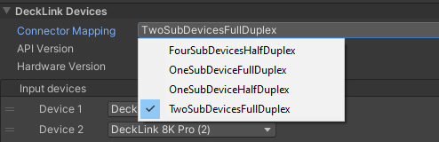
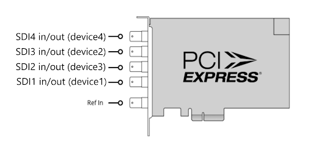
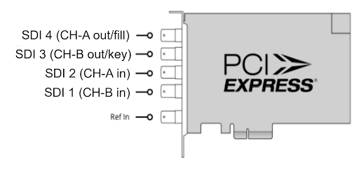
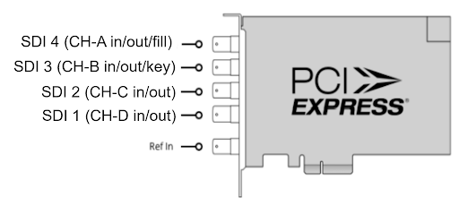
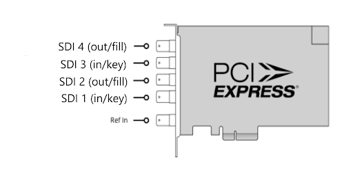

# Blackmagic DeckLink 8K Pro connection mapping

Blackmagic Video automatically detects the Blackmagic DeckLink card that you are using. The connector mapping profiles that are available from the drop-down depend on the model of the card. 

For example, the following four connector mapping profiles are available for the **Blackmagic DeckLink 8K Pro** card.

* **Device**: Logical device used on the card. The number of logical devices depends on the model of the card.
* **Half duplex mode:** Physical connectors can be an input or an output.
* **Full duplex mode:** One connector is used for input, the second acts as a loop output of the input.

The following describes these four connector mapping profiles, an example of how they can be configured, along with what is supported.

**1.** **Four Sub Devices Half Duplex:** Four available devices.

| **Port Usage**| **8K Support**|**Keying Support**| **Loop Through**|
|:---|:---|:---|:---|
| Input or Output | No | No | No |

**2.** **One Sub Device Full Duplex:** One available device.

| **Port Usage**| **8K Support**|**Keying Support**| **Loop Through**|
|:---|:---|:---|:---|
| SDI 1 & 2 In   SDI 3 & 4 Out | No | Yes |When using connector 1, the signal will be looped through connector 3.   When using connector 2, the signal will be looped through connector 4.|  

**3.** **One Sub Device Half-Duplex:** One available device. 

| **Port Usage**| **8K Support**|**Keying Support**| **Loop Through**|
|:---|:---|:---|:---|
| SDI 1 to 4 In or Out | Yes | Yes (internal) | No |

**4.** **Two Sub Device Full Duplex:** Two available devices. Each device is in AND out.

| **Port Usage**| **8K Support**|**Keying Support**| **Loop Through**|
|:---|:---|:---|:---|
| SDI 1 In   SDI 2 Out | No | Yes | No | 
 
 

 