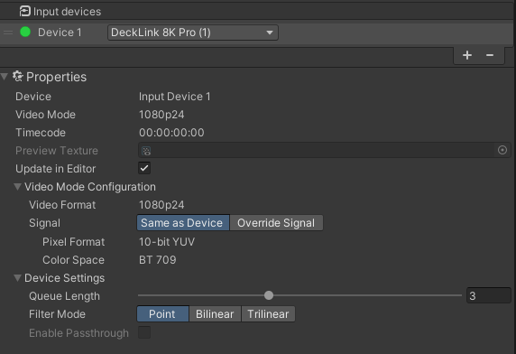

[Contents](TableOfContents.md) | [Home](index.md) > [Getting started](getting-started.md) > Adding and configuring an input device

# Adding and configuring an input device

To receive and display SDI video, you can use an **Input Device**, added through the **Blackmagic Video Manager** window.

You can add **input devices** by pressing the **+** symbol, in the **Input Devices** list. After selecting this new device, you can visualize its configuration in the **Properties** section, below the list.

You can access the following **Properties**:

| **Property:**      | **Function:**               |
| :----------------- | :-------------------------- |
| __Video Mode__ | The video mode of the input device. For example HD1080p. |
| __Timecode__ | Displays the current timecode of the primary clock for the input device. Timecode synchronizes live data sources so that recordings and real-time frame outputs are temporarily coherent.|
| __Preview Texture__ | Preview the incoming texture that contains the input video, received by the SDI port and device in use. |
| __Update in Editor__ | Enable to keep the video mode synched and updated in the Editor. |
| __Video Format__ | The video format received by the current SDI port and device in use. |
| __Signal__ | Configures the frame rate, resolution, and scanning mode in 2 different ways.   **1.** **Same as Device**: Uses the same pixel format, color space, and transfer function as the input device.   **2.** **Override Signal**: Forces Unity to interpret the signal using a different pixel format, color space or transfer function.|
| __Pixel Format__ | The pixel format used by the current input device. For example: YUV 10 bits. |
| __Color Space__ | The color space used by the current input device. For example: Rec. 709. |
| __Transfer Function__ | (If applicable): For example, HLG in Rec. 2020. |
| __Convert Color Space__ | Used to convert from Unity color space. The conversion for Rec. 2020 applies **Bt. 2047** and **Bt. 2087** to convert to and from the Unity working color space.   |
| __Queue Length__ | Maximum number of received frames in the queue. A bigger value can be useful to avoid potential dropped frames (unused input frames are removed from frame to frame). |
| __Filter Mode__ | The filtering used for the allocated RenderTexture. The different options have different performance costs and image quality. |
| __Enable Pass through__ | Enable to follow the connector mapping loop through. For example, if you have **OneSubDeviceFullDuplex** when using connector 1, the signal will be looped through connector 3. When using connector 2, the signal will be looped through connector 4. The pass through is available depending on the connector mapping you have selected. |
