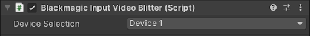
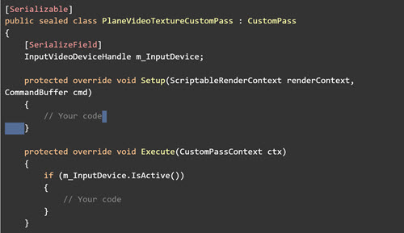

# Retrieving device data

For [samples](samples.md), it’s possible to retrieve any **Input** or **Output** device data in a custom **Monobehaviour** or **Custom Pass**. 

The Blackmagic video package introduces two new attributes named `InputVideoDeviceHandle` and `OutputVideoDeviceHandle`, offering access to a specific device in the **Blackmagic Video Manager**. 

To write a custom script to retrieve device data, simply follow these instructions:

* Create your **MonoBehaviour** script or your **CustomPass**.
* Instantiate a class property: an `InputVideoDeviceHandle` to get an input device, or an `OutputVideoDeviceHandle` to get an output device. 
* In the inspector a new dropdown will be displayed on your **Custom Pass** or **Monobehaviour**, allowing you to select the device you want to use.
* On each frame update, you must check the validity of the device by calling the `IsActive` method.
* If the device selected is valid, you can retrieve its data by calling the getters you are interested in.

Example:

