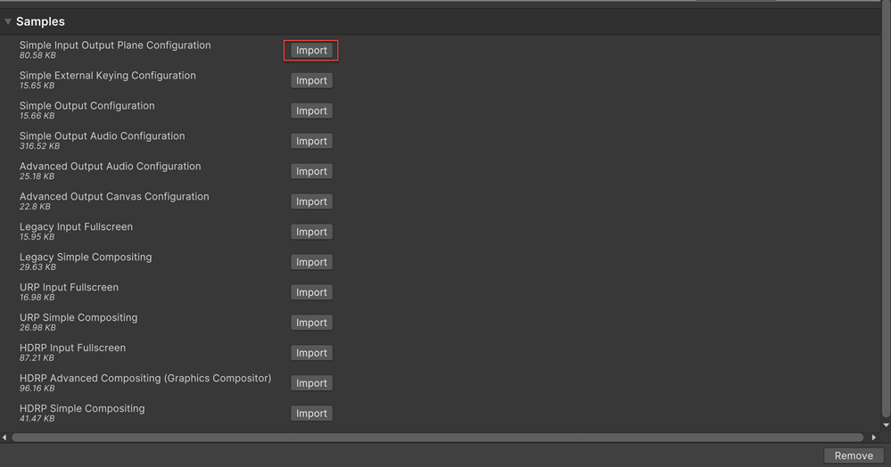
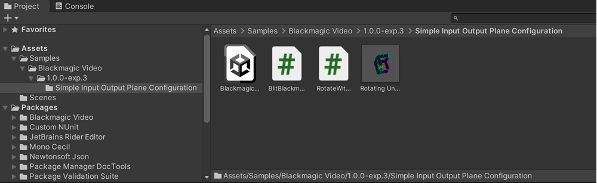

# Adding samples

To add a sample to your project: 

1. Navigate to **Window > Package Manager**. 

2. Locate **Blackmagic Video** in the list of available packages, and select it. Under the package description, there is a list of available samples. 

3. Click the **Import** button next to the sample you wish to add.

**Note**: When using multiple samples per project, there can be a conflict if you are importing the same script. To resolve this, you can:

* Remove one of the two scripts.
* Remove the previous sample.

Unity places imported samples in your Project's Asset folder under **Assets > Samples > Blackmagic Video > [version number] > [sample name]**.

