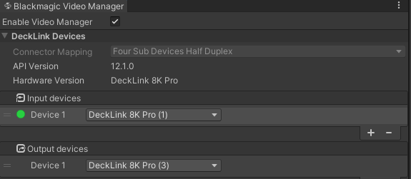

# Enabling the Blackmagic Video Manager

To start using Blackmagic Video in your Unity project, open the following new window at the top: **Window > Virtual Production > Blackmagic Video Manager**. 

By default, the manager is disabled for the active scene, but if you check the **Enable Video Manager** checkbox, you should see the following in the window: 

You should see your Decklink card appear in the **Hardware version** field.

The current **API Version** can vary from one project to another, as it represents the current driver version installed on your computer and the current SDK compiled from our package.