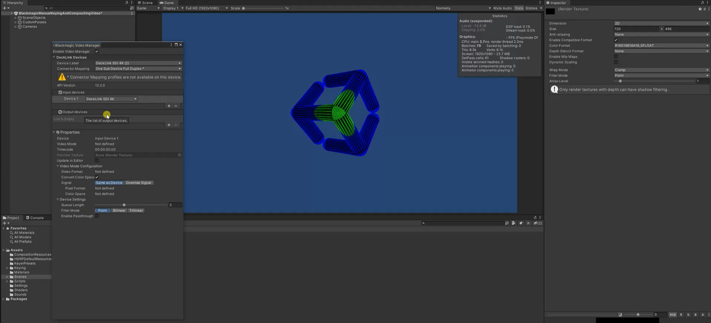

# Features

The **Blackmagic Video** package supports the following features:

- Automatic detection of the available DeckLink cards and driver versions.
- Ability to modify connector mappings directly from the Unity interface.
- Interlaced and progressive standard HD, Full HD, and UHD (4K) video.
- Multiple simultaneous inputs and outputs.
- HDR and Audio input and output.
- Compatibility with standard color spaces: BT601, BT709, and BT2020 (HDR, HLG, and PQ).
- Compatibility with GPUDirect technology.
- Works with all of Unity’s render pipelines (Legacy, URP, and HDRP).
- Works in the Editor, Play mode, and in Standalone builds.
- Internal and external fill-and-key.
- Pass-through and Low latency mode.
- Single/Dual/Quad Link for output devices. 
- Timecode integration for input and output devices.
- Public API in C#.

