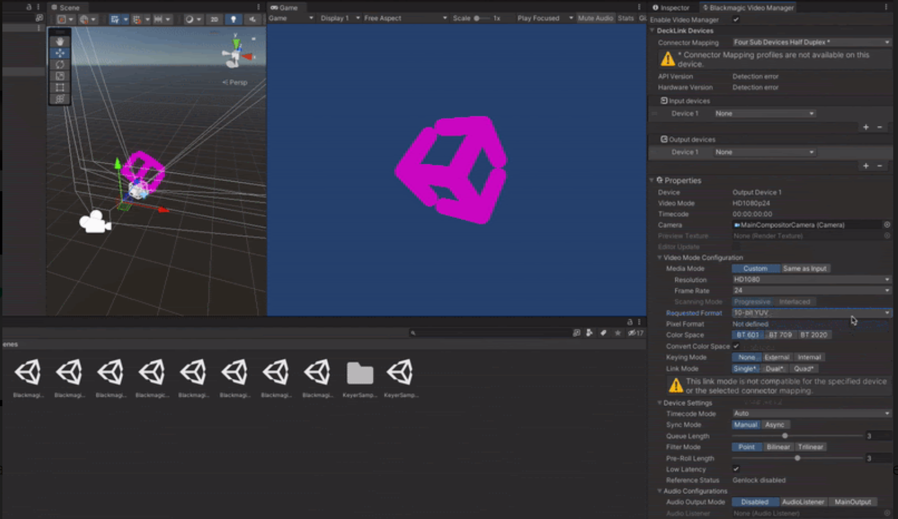

# Blackmagic Video package

>[!NOTE]
>To use the Blackmagic Video package, you must install it separately. For detailed information about package requirements and installation instructions, refer to [Installation](installation.md).

The **Blackmagic Video** package helps you leverage video capture cards from **Blackmagic Design** to input and output pro-grade video and audio in the Unity Editor and runtime builds, unlocking new workflows for users working in film, virtual production, live events, and broadcast.

The package allows you to:

- Capture and output SDI video from and to the Unity Editor from a Blackmagic capture card.
- Render composited video feeds in the Editor and output via SDI.

## In this documentation

 | Section | Description |
 |:---|:---|
 | [Installation](installation.md) | Install the Blackmagic Video package and learn about the package requirements. |
 | [Features](features.md) | Learn about the features and capabilities of the Blackmagic Video package. |
 | [Getting started](getting-started.md) | Enable the Blackmagic Video Manager, map your hardware connections, add and configure input/output video devices, enable video compositing in HDRP, and more. |
 | [Samples](samples.md) | Install samples (provided along with the package) to explore more advanced Blackmagic Video configuration examples. |

 _See also the full [table of contents](TableOfContents.md)_
