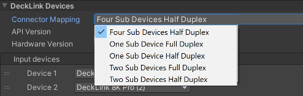

# Managing the connector mapping profile

Blackmagic Video offers the ability to directly control the **Connector mapping** of your card, without using the **Desktop Video Setup** software. 

You can refer to the Blackmagic website for more information on your hardware. Different Blackmagic DeckLink products support a different range of connector mappings, indicated on the product webpage. Five Connector Mapping profiles are supported:

| **Connector Mapping Profile:**      | **Function:**               |
| :----------------- | :-------------------------- |
| __Four Sub Devices Half Duplex__ | Supports 4 independent sub-devices that can be either input or output.|
| __One Sub Device Full Duplex__ | Supports 1 sub-device for the input and 1 sub-device for the output.|
| __One Sub Device Half Duplex__ | Supports 1 sub-device that can be either input or output.|
| __Two Sub Devices Full Duplex__ | Supports 2 sub-devices for the input and 2 sub-devices for the output.|
| __Two Sub Devices Half Duplex__ | Supports 2 sub-devices that can be either input or output. |

You can refer to the [Blackmagic DeckLink 8K Pro connection mapping documentation](decklink-8k-pro-connection-mapping.md) to understand what these profiles are and how they can be used as an example. 
 