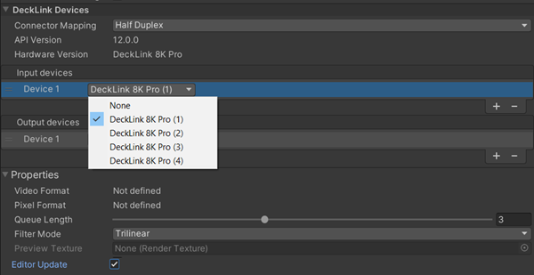

# Mapping a new device to an SDI port

You can map a new device to an **SDI port** by selecting one of the **SDI ports** detected in the dropdown, next to the device. The number of available SDI ports depends on your Blackmagic Decklink card and the **Connector Mapping** selected.

All Blackmagic actions take place in this window, you don't need to add anything to your scene to make your devices work. You can find concrete implementations demonstrated in the [samples](samples.md) section.

