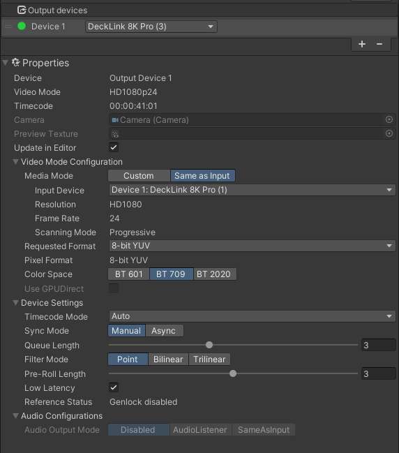

[Contents](TableOfContents.md) | [Home](index.md) > [Getting started](getting-started.md) > Adding and configuring an output device

# Adding and configuring an output device

To output frames through an SDI port (for example, an SDI Monitor), you can use an **Output Device**, added through the **Blackmagic Video Manager** window.

You can add **output devices** by pressing the **+** symbol, in the **Output Devices** list. After selecting this new device, you can visualize its configuration in the **Properties** section, below the list.

You can access the following **Properties**:

| **Property:**        | **Function:**               |
| :------------------- | :-------------------------- |
| __Video Mode__ | The video mode of the output device. For example HD1080p. |
| __Timecode__ | Displays the current timecode of the primary clock for the input device. Timecode synchronizes live data sources so that recordings and real-time frame outputs are temporarily coherent. |
| __Preview Texture__ | Preview the outgoing texture. |
| __Update in Editor__ | Enable to keep the video mode synched and updated in the Editor. |
| __Media Mode__ | Configures the resolution, frame rate, and scanning mode in 2 different ways.    **1.** **Custom**: Manually configures the video configuration.    **2.** **Same as Input**: Automatically matches the video configuration of a preselected input device. It uses the same resolution, frame rate, and scanning mode as the input device.|
| __Requested Format__ | You can request an alternative pixel format capture path if available. This operation is executed asynchronously. For example: YUV 10 bits. |
| __Pixel Format__ | The effective Pixel Format (in case the requested one is not compatible with your configuration). |
| __Color Space__ | The color space of the output device. The possible values for Blackmagic supported color spaces are **BT601**, **BT709**, and **BT2020** (HDR, HLG, and PQ). |
| __Convert Color Space__ | Used to convert from Unity color space. The conversion for Rec. 2020 applies **Bt. 2047** and **Bt. 2087** to convert to and from the Unity working color space.|
| __Use GPUDirect__ | Enable to use GPUDirect on compatible NVIDIA GPUs. |
| __Timecode Mode__ | You can choose from the following options:    **1.** **Auto**: The timecode is calculated from the frame number.   **2.** **Same as Input**: The timecode is given by the input video associated with this output device. |
| __Sync Mode__ | If the Frame Sender instance is the main one then, v-sync is disabled. The current frame rate is used for capture and the main instance waits for sender completion every end-of-frame. |
| __Queue Length__ | Maximum number of received frames in the queue. A bigger value can be useful to avoid potential dropped frames (unused input frames are removed from frame to frame). |
| __Filter Mode__ | The filtering used for the allocated RenderTexture. The different options have different performance costs and image quality. |
| __Pre Roll Length__ | Configures the maximum number of pre-rolled frames. |
| __Low Latency__ | Enable to wait for the completion of every frame in the queue. Using this mode will result in a large performance hit and should be used sparingly. |
| __Reference Status__ |  Indicates the genlock status display. |
| __Audio Output Mode__ | Selects where the audio samples will be taken from in the scene. |
| __Audio Listener__ | Audio listener that is used for supplying the audio content. |
| __Same as Input__ | The audio will come from the Input device (for example a camera or video). |
