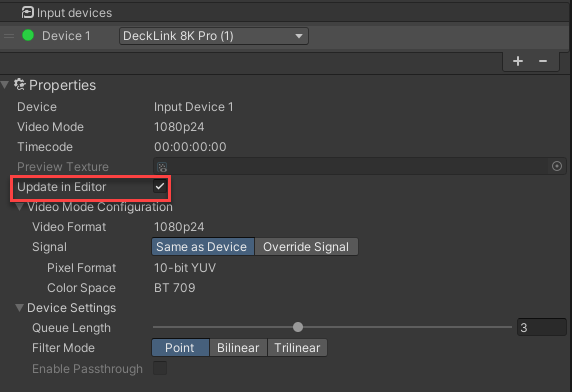

[Contents](TableOfContents.md) | [Home](index.md) > [Getting started](getting-started.md) > Using Blackmagic Video in different modes

# Using Blackmagic Video in different modes

Blackmagic Video can be used in both **Editor** mode and **Play** mode:  

* For Editor mode, press the **Update in Editor** checkbox on each device in your **Blackmagic Video Manager** window.

* For Play mode, simply press Unity's **Play** button.
